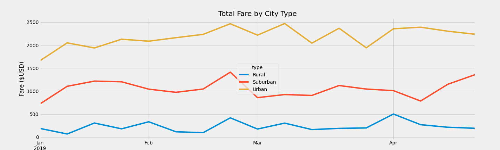

# PyBer_Analysis
  
### Module 4 PyCitySchools Challenge 
**File:** [PyBer Challenge](PyBer_Challenge.ipynb)

## Overview of PyBer Analysis:
The purpose of this analysis is to understand how PyBer is doing in each city type by cleaning the data through groupbys, loc and pivot tables to then produce a story that can be understood by others using a chart.      

## Results:
**PyBer summary including all three types of cities:**

- Urban cities have a significantly higher number of total rides, total drivers, total fares compared to suburban and rural cities while also having the lowest average fare per ride and average fare per driver. 

- Rural cities have approximately 5 times less riders, approximately 6 times less total drivers and approximately 5 times less in total fares than suburban cities but only being 4 dollars more in the average per ride with $34.62 compared to suburban cities average fare per ride being $30.97.

- All three city types hit a peak near the end of febuary
- Suburban cities has a increase in fares close to mid april, urban cities slightly decline and rural cities plateau 
- Rurual cities hit their highest peak in april

## Summary:

